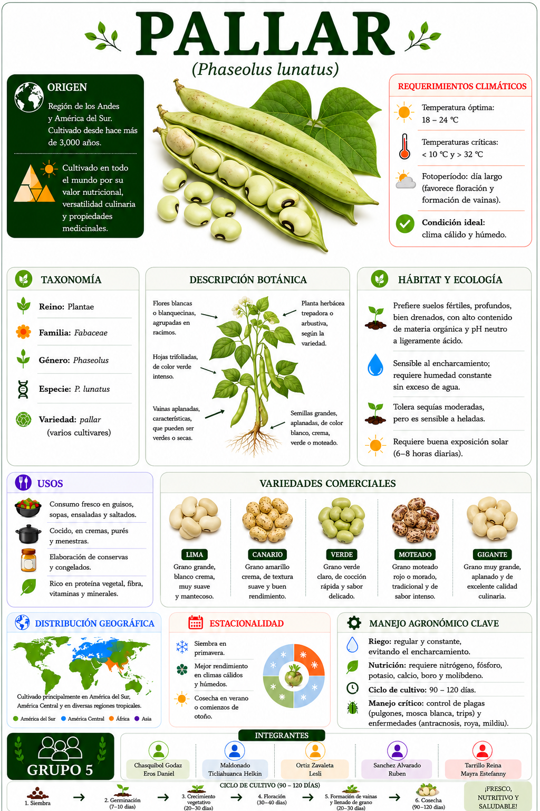

<html lang="es">
<head>
<meta charset="UTF-8">
<meta name="viewport" content="width=device-width, initial-scale=1.0">
<title>pallar</title>

</head>
<body>

</body>
</html>

# Cargar librería
library(qrcode)

# URL de la página
url <- "https://leszavaleta.github.io/semillas-/pallar.html"

# Crear QR
qr <- qr_code(url)

# Guardar QR en alta calidad
png(
  filename = "QR_pallar.png",
  width = 3000,
  height = 3000,
  res = 300
)

par(mar = c(0,0,0,0))
plot(qr)

dev.off()

