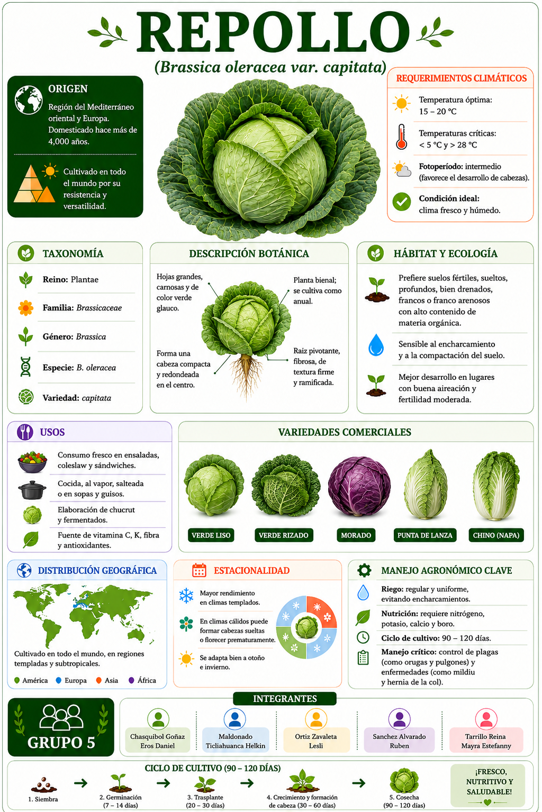

<html lang="es">

<head>

<meta charset="UTF-8">

<meta name="viewport" content="width=device-width, initial-scale=1.0">

<title>Repollo</title>

</head>

<body>

</body>

</html>

# Instalar una sola vez
install.packages("qrcode")

# Cargar librería
library(qrcode)

# URL de la página
url <- "https://leszavaleta.github.io/semillas-/repollo.html"

# Crear QR
qr <- qr_code(url)

# Guardar QR en alta calidad
png(
  filename = "QR_Repollo.png",
  width = 3000,
  height = 3000,
  res = 300
)

par(mar = c(0,0,0,0))
plot(qr)

dev.off()
