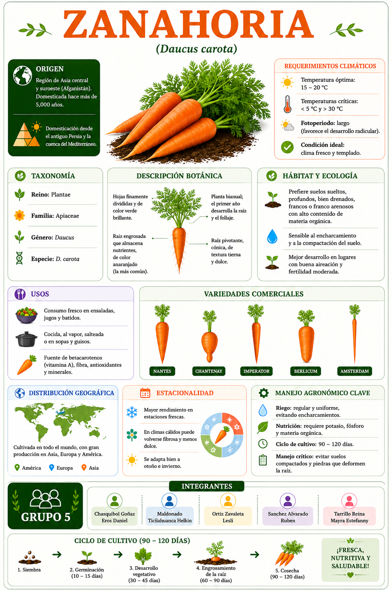

<html lang="es">

<head>

<meta charset="UTF-8">

<meta name="viewport" content="width=device-width, initial-scale=1.0">

<title>Repollo</title>

```{=html}
<style>
body{
    margin:0;
    background:white;
}

img{
    width:100%;
    display:block;
}
</style>
```

</head>

<body></body>

</html>

install.packages("qrcode")

library(qrcode)

url <- "https://leszavaleta.github.io/semillas-/zanahoria.html"

# Crear QR
qr <- qr_code(url)

# Guardar QR
png(
  filename = "QR_zanahoria.png",
  width = 3000,
  height = 3000,
  res = 300
)

par(mar = c(0,0,0,0))
plot(qr)

dev.off()
